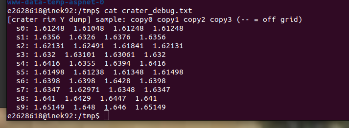

# Term Project: Turning a Terrain Renderer into a Combat Flight Simulator

## Introduction

This is the journey log for the term project of CENG 469 Computer Graphics 2, which takes
the HW2 environment-mapped terrain renderer and extends it into a small combat flight
simulator. The HW2 renderer already drew a B-spline terrain, water, and a sky; the term
project adds gameplay on top of that terrain — flying a plane, firing missiles, killing
enemies, and deforming the ground.

The project was originally meant to be collaborative with my friend İsmail, but we struggled
to communicate during it, so we ended up working separately. We had picked the missile and
plane 3D models together earlier on. He sent me his codebase with the parts he had already
done — hit detection, missile flight physics, and the chosen models placed in the scene — and
I extended it from there, hoping we might merge our work later. I didn't realize until late
that he had already finished his own version separately. The features documented in this post
are the ones I built on top of his foundation.

My contribution is the enemy planes with Lorenz-attractor flight, multi-enemy spawning, the
bounding sphere collision visualization, the terrain crater deformation compute shader, the
CPU height cache, the red hit-feedback flash, the sprite-sheet explosions on both enemy and
terrain hits, and all the bug fixes documented in this post.

The fixes described here are mostly small — a usage flag, a clamp, a sign change, a
threshold — but most of the work was in locating them, since the cause was usually a layer
or two away from the symptom.

The topics, roughly in the order they were tackled:

- Architecture: a CPU logic layer, GPU deformation, and why I don't read the terrain back
- Implementation: the enemy's Lorenz-attractor flight, the red hit-feedback flash, multi-enemy spawning, sprite-sheet explosions on enemy and terrain hits, the crater compute shader, the CPU height cache, and a fully GPU-side explosion system as the next step
- The out-of-memory problem (GL_DYNAMIC_READ + per-frame readback)
- The Lorenz attractor producing NaN on the first frame
- Boundary vertex duplication and the torn crater rim
- The cull threshold removing the crater floor
- The normal sign flip that inverted the lighting

---

## Architecture Decisions

### combat.hpp — an engine-agnostic logic layer

Before writing any rendering code, I pulled all of the game logic out into a single header,
`extracted/combat.hpp`, with no OpenGL in it — no GL calls, no shaders, just `glm` and the
standard library. It defines the `Missile`, the `EnemyPlane`, the Lorenz attractor
integrator, the swept-sphere collision test, and a `HeightGrid` + `deformCrater` pair that
carves a crater into a plain CPU heightfield.

I extracted it first to keep my options open. At the point I wrote it I hadn't fully
committed to which codebase the project would live in, and a header with zero engine
dependencies can be dropped into either one. The intention was that the same logic could
later be ported onto the professor's codebase as well, not just İsmail's — the math would
not have to change, only the thin layer that feeds it data and reads its results.

In the end I only completed the integration against İsmail's codebase. I did not have time to
port it onto the professor's code, so that stayed a goal rather than a finished result. But
structuring the logic this way still paid off: `combat.hpp` became the source of truth. The
math in it is the readable reference implementation, and the compute shader is a port of that
same math onto the GPU. When the shader misbehaves, I can read the C++ version next to it and
check whether the GLSL still does the same thing. That was useful during the crater
debugging — being able to compare the CPU `deformCrater` line-for-line against `carve_crater`
in the shader made the differences easy to spot.

### Why a compute shader for deformation (and why I don't read the terrain back)

The terrain is a large tessellated B-spline mesh whose vertices live in a Shader Storage
Buffer Object on the GPU. When a missile hits the ground, I want to push a circle of those
vertices down into a bowl.

There are two ways to do that. The first is to keep the terrain on the CPU: read the
affected vertices back with `glGetBufferSubData`, modify them, and re-upload. The second is
to never move the data — bind the vertex SSBO to a compute shader and edit it in place on
the GPU.

I chose the compute shader. Moving vertex data across the bus per frame is expensive: the
terrain VBO is large, and a GPU→CPU→GPU round trip every time a crater forms (or, worse,
every frame to keep a CPU copy in sync) stalls the pipeline. The design rule I settled on
is:

> Keep the heavy data on the GPU. Only sync small things back to the CPU, and only on
> events, not per frame.

The only thing the CPU actually needs from the GPU is a single bit: did a missile hit the
enemy this frame? That is one `uint`. Everything else — the deformed terrain, the missile
positions, the explosion state — stays GPU-resident and is never read back. The
out-of-memory section below is what happens when this rule is broken.

---

## Implementation

### The enemy plane and its Lorenz-attractor flight

The enemy needs to fly a path that feels alive — it should wander, bank, and never settle
into an obvious loop — without me hand-authoring waypoints. The Lorenz attractor is a clean
way to get exactly that. It is the classic chaotic system:

```
x' = sigma*(y - x)
y' = x*(rho - z) - y
z' = x*y - beta*z
```

with the standard chaotic-regime constants (`sigma = 10`, `rho = 28`, `beta = 8/3`). Two
properties make it a good flight path. First, the trajectory is **bounded** — it stays inside
a finite region of space (the familiar butterfly shape), so the enemy never flies off to
infinity. Second, it **never exactly repeats**: the system is deterministic but extremely
sensitive to its state, so the path loops around forever without ever retracing itself. That
gives an endless, non-repeating route for free.

Each frame I advance the attractor state by integrating it with **RK4** (the fourth-order
Runge-Kutta method — four derivative evaluations per step, combined with the usual `1/6,
1/3, 1/3, 1/6` weights). RK4 is stable enough to keep the attractor on its proper orbit
instead of spiralling off the way a naive Euler step would. The raw attractor coordinates are
small and centred on the origin, so I map them into the play volume with a per-axis scale and
a translate:

```cpp
glm::vec3 newPos = e.state * e.path.scale + e.path.translate;
```

The scale stretches the attractor's units into world units, and the translate recenters the
butterfly over the play area (above and around the player's start).

For orientation, the plane should point where it is going and bank into its turns rather than
snapping to each new heading. So I derive the orientation from the velocity direction. Each
frame I take the velocity as the difference between this frame's position and the last, build
a target quaternion that faces along it, and **slerp** the current orientation toward that
target by a `turnRate * dt` fraction:

```cpp
glm::vec3 vel = newPos - e.position;
if (glm::dot(vel, vel) > 1e-8f) {
    glm::quat target = orientationFromForward(glm::normalize(vel));
    float t = glm::clamp(e.path.turnRate * dt, 0.0f, 1.0f);
    e.orientation = glm::slerp(e.orientation, target, t);
}
```

The slerp is what makes the motion read as flight — the plane eases between headings smoothly,
so fast direction changes in the attractor become banking turns instead of instant rotations.

### Hit feedback: flashing the enemy red

When a missile strikes the enemy, the plane shouldn't just vanish — there should be a brief
visual acknowledgment of the hit. A hit timer drives this. The moment `enemy.alive`
transitions from true to false, a `hitTimer` is set to a small duration (around 2 seconds),
and the enemy keeps being rendered while the timer counts down. During that window, the
plane's fragment shader mixes its final color heavily toward red so the hit reads clearly.
After the timer reaches zero, the enemy stops being drawn. It is a small effect but it makes
the moment of contact feel intentional rather than instantaneous, and it pairs with the
explosion sprite animation that plays at the same position.

### Spawning more enemies

A single enemy gets boring quickly during testing, so I bound the N key to spawn an
additional enemy plane at runtime. Each new enemy is pushed into a
`std::vector<combat::EnemyPlane>` with a slightly perturbed Lorenz seed and a translated path
centre, so they don't all trace the same butterfly through the same patch of sky. The
per-frame loop iterates over the vector for updates, rendering, hit checks, and the red-flash
timer — each enemy keeps its own state. The bounding sphere and hit feedback work identically
per enemy.

It is a small quality-of-life feature but it makes the scene feel more like a target range
than a single duel, and it stress-tests the missile collision and explosion paths against
multiple targets at once.

### Explosion sprites on enemy hit

When a missile strikes an enemy, the red flash is followed by a proper explosion
animation drawn at the impact position. The animation is a 4-frame sprite sheet — small
flash, medium burst, large burst, smoke — preprocessed at load time: the JPG's white
background is keyed to transparent (any pixel with all channels above ~240 gets alpha = 0)
and uploaded as a single RGBA texture, with the four frames laid out side by side. Each
frame is one quarter of the texture's width.

The explosion itself lives in `combat.hpp` as a small struct:

```cpp
struct Explosion {
    glm::vec3 position;
    float     timer;
    float     duration;   // 0.35 seconds total
    bool      alive;
};
```

When an enemy is hit, an `Explosion` is pushed into a `std::vector<Explosion>` at the enemy's
world position. Each frame, all alive explosions advance their timer, and any whose timer
exceeds `duration` are erased.

Rendering is a camera-facing billboard. The vertex shader takes no attributes — it builds the
four quad corners from `gl_VertexID` (as a triangle strip) and offsets them in view space, so
the quad always faces the camera regardless of orientation. The current frame is computed from
the timer:

```glsl
int   frame = clamp(int(timer / duration * 4.0), 0, 3);
float u     = (float(frame) + cornerU) / 4.0;
```

so the sub-UV samples only that frame's quarter of the sheet. The fragment shader samples the
texture, discards keyed-transparent pixels, and uses additive blending (`GL_ONE, GL_ONE`) so
bright bursts read well in the HDR pipeline without needing a meaningful alpha channel in the
MRT output. Depth testing stays on so terrain still occludes explosions, but depth writes are
off so explosions don't occlude each other awkwardly.

This is a CPU-side feature. The enemy's world position is known on the CPU (it comes from the
Lorenz integration each frame), so spawning the explosion there is straightforward — no GPU
readback needed. Terrain hits are different: the impact point lives on the GPU inside the compute
shader, so they need a small bridge to come back across. That bridge is the subject of the next
section.

### Terrain-hit explosions

A missile hitting the ground produces a crater, but the crater alone reads more as "something
changed" than as "something blew up." To make terrain hits land with the same visual weight as
enemy kills, the same explosion billboard plays at the impact point on the ground.

The complication is that a terrain hit is detected entirely on the GPU, inside the missile
compute shader. The CPU never sees the missile's position frame to frame, so it cannot spawn an
explosion the way it does for enemies. The fix is a small GPU→CPU channel that reuses the same
gated-readback pattern as the enemy-hit flag, just carrying a position instead of a bit.

A new SSBO holds a single `vec4 terrainImpact` — three components for the world position, one
for a flag. When the compute shader detects a terrain hit it writes the impact world position
into this buffer and sets the flag to 1.0:

```glsl
terrainImpact = vec4(explosion_point, 1.0);
```

The buffer is zeroed every frame before the dispatch, so anything written this frame is fresh.
After the dispatch, inside the same `if (anyMissileActive)` gate that reads the enemy-hit flag,
the CPU reads `terrainImpact`:

```cpp
if (terrainImpact.w > 0.5) {
    explosions.push_back({ glm::vec3(terrainImpact.x, terrainImpact.y, terrainImpact.z),
                           0.0f, 0.35f, true });
}
```

From here the rendering path is identical to the enemy-hit case — same `Explosion` struct, same
billboard shader, same additive blending. The compute shader is the source of the position;
everything downstream is the existing pipeline.

One limitation: the buffer is a single `vec4`, so if two missiles hit terrain in the same frame,
the second overwrites the first and only one explosion spawns. For a single-player scene with one
player firing, this is fine — simultaneous ground hits in the same frame would be coincidence,
not a normal case. The cleaner shape is an append buffer with an atomic counter, which would
store an arbitrary number of impacts per frame; that is the same pattern the rain particle
system would use, but I did not implement it here.

#### What I would do next: GPU-only explosions

The architecture rule throughout this project has been to keep heavy data on the GPU and only
sync small things back to the CPU on events. Explosions are the one place that rule bends — the
explosion list lives on the CPU, the GPU has to report impact positions across the bridge, and a
CPU billboard pass renders them. It works, but it is the last meaningful CPU↔GPU exchange in the
system.

The natural next step is a fully GPU-side explosion system: a self-contained explosion SSBO that
the compute shader writes directly when a hit happens (both enemy and terrain), a small per-frame
compute pass that advances each explosion's timer and reaps expired ones, and instanced billboard
rendering that reads positions and timers straight from the SSBO with `glDrawArraysInstanced`. No
CPU bridge, no readback, no `std::vector<Explosion>` — the CPU never sees an explosion exist. This
is also the structure rain or any other particle system would use, since thousands of particles
cannot reasonably be managed CPU-side. I did not have time to migrate to this architecture for the
term project, but it is the obvious continuation of the design and would close the last gap left
by the gated-readback pattern.

### Toggling the bounding sphere debug view

The enemy's collision volume is rendered as a wireframe sphere around its body so I can see
what the missile is actually hitting. During development this is essential, but in the final
scene the wireframe is visual noise. I bound the B key to toggle a `showBoundingSpheres` bool.
When the flag is on, each alive enemy draws its wireframe sphere; when it's off, the sphere
render is skipped but the collision math is unchanged. The default is on, so the spheres are
visible at startup and can be hidden for a cleaner shot.

### Terrain crater deformation in the compute shader

The deformation lives inside the missile compute shader. The dispatch is one invocation **per
missile** (256 threads, one per missile slot), and the missile that strikes the ground is the
one that carves. That invocation walks a square of cells around the impact point, and for each
cell whose distance to the impact is within the blast radius it displaces **only the vertex's
Y** — the crater is a height change, nothing in X or Z moves.

The radial profile is a smooth bowl with an optional raised lip. Let `n` be the normalized
distance from the centre (`0` at the impact point, `1` at the rim). The bowl is deepest at the
centre and eases out to nothing at the edge via a `smoothstep`, and a separate `smoothstep`
band near the rim adds the raised lip:

```glsl
float n    = dist / radius;                              // 0 centre .. 1 edge
float bowl = -depth * (1.0 - smoothstep(0.0, 1.0, n));   // deepest at centre
float rimv = rim * smoothstep(0.0, 1.0, clamp((n-0.6)/0.3, 0.0, 1.0))
                 * (1.0 - smoothstep(0.0, 1.0, clamp((n-0.9)/0.1, 0.0, 1.0)));
```

The carve is done in **two passes** over the same affected region:

- **Pass 1 — displace.** For every vertex in range, add `bowl + rimv` to its stored Y. After
  this pass the geometry is correct but the normals are stale.
- **Pass 2 — recompute normals.** Walk the region again and rebuild each vertex's normal from
  the *new* heights using central differences — sample the height one step left/right and
  up/down, and the cross-slope gives the surface normal. This has to be a second pass because
  a correct normal at a vertex depends on its neighbours' final heights, so all the
  displacement has to be done first.

(Both passes also have to write every duplicate copy of a shared vertex, which is its own
story — see the boundary-duplication section below.)

### The CPU height cache

The no-readback rule creates a gap: CPU-side logic still occasionally needs to know "how high
is the terrain at world position (x, z)?" — for spawn placement and collision reasoning — and
it can't ask the GPU for it every frame.

The answer is a dedicated **CPU height cache**: a 769×769 row-major grid of floats
(`heights[z * width + x]`) built alongside the GPU VBO from the same B-spline evaluation, with
**bilinear interpolation** for queries that fall between samples. It is a compact array
(roughly a couple of megabytes), so unlike the full vertex mirror it is cheap to keep around
after upload. Any CPU query for terrain height samples this grid instead of touching the GPU.

One deliberate limitation: the cache holds the **original** terrain heights. GPU-side crater
deformations are *not* synced back into it — doing so would mean reading the deformed vertices
off the GPU every frame, which is exactly the round trip the architecture is built to avoid.
The CPU's view of the ground stays the undeformed heightfield by design.

---

## The Bugs I Fought

### Out of Memory: the per-frame readback

The enemy-hit feature needs one bit from the GPU: was the enemy struck? The first
implementation created a one-`uint` SSBO, marked it `GL_DYNAMIC_READ` because I intended to
read from it, and then read it every frame with `glGetBufferSubData`:

```cpp
glBufferData(GL_SHADER_STORAGE_BUFFER, sizeof(GLuint), &zero, GL_DYNAMIC_READ);
...
// inside the render loop, every frame:
glGetBufferSubData(GL_SHADER_STORAGE_BUFFER, 0, sizeof(GLuint), &enemyHitFlag);
```

That looks reasonable, but it is a problem. The console filled, every frame, with:

```
Buffer object 16 (GL_SHADER_STORAGE_BUFFER, GL_DYNAMIC_READ) is being
copied from VIDEO to HOST memory
```

`GL_DYNAMIC_READ` tells the driver the CPU will read the buffer frequently, so the driver
keeps a host-side mirror and, combined with a per-frame `glGetBufferSubData`, repeatedly
stages the buffer from video memory into host memory. The staging churn grew host memory
until the process ran out. A one-`uint` buffer consumed a large amount of RAM because the
usage hint and the access pattern together told the driver to do the worst possible thing.

The fix has two halves, which together are the architecture rule above:

1. **Change the usage hint.** `GL_DYNAMIC_READ` → `GL_DYNAMIC_COPY`. The flag should not
   advertise that the CPU reads the buffer constantly. (`GL_DYNAMIC_COPY` means the GPU
   produces and mostly consumes it, with no host mirror required.)
2. **Gate the readback to an event.** Do not poll every frame. Only read the hit flag while
   a missile is in flight, and stop the moment the answer arrives:

```cpp
// only read while a missile could still be live; stop the moment we get a hit
if (anyMissileActive && enemy.alive) {
    glGetBufferSubData(GL_SHADER_STORAGE_BUFFER, 0, sizeof(GLuint), &enemyHitFlag);
    if (enemyHitFlag != 0) {
        enemy.alive      = false;   // stop drawing it
        anyMissileActive = false;   // stop polling immediately
        GLuint zero = 0;            // reset the flag so it can't re-trigger
        glBufferSubData(GL_SHADER_STORAGE_BUFFER, 0, sizeof(GLuint), &zero);
    }
}
```

One caveat: the CPU has no direct way to know a GPU-side missile is "done," because the
missile's active state lives in the SSBO and I deliberately don't read it back. So
`anyMissileActive` is driven by a CPU-side lifetime timer — a missile is assumed live for an
upper-bound window (maximum flight time plus the explosion fuse) after firing, and the gate
closes when that window elapses or when a hit is detected, whichever comes first. It is an
estimate, but it costs zero readbacks, which is the goal.

The rule to take away: do not leave an SSBO readback running per frame. Gate it to an event.

That was the plan, anyway — in practice the gate did not close as cleanly as designed. The
readback spam was reduced but not eliminated. The gate is implemented as a fixed 5-second
lifetime window after each shot, based on the assumption that a missile is either resolved or
expired within that time. In practice the warnings continued well past 5 seconds in my
testing, so something in the gate is still not closing as intended — I tried debugging with
prints to check whether `anyMissileActive` actually flips back to false, but did not finish
chasing it down before moving on to the remaining gameplay features. The proper fix is
probably to drive the gate from an actual GPU-side signal (the missile's own dead/expired
state) rather than a CPU-side timer estimate, but doing that without per-frame readback is the
same problem one level deeper. The spam is reduced from "every frame forever" to
"every frame while a shot is considered live," which kept the OOM from happening but is not a
finished solution.

### The Lorenz attractor producing NaN

With the readback fixed, I wired up the enemy's flight path described above. On the first
frame, the enemy plane printed its position as `(nan, nan, nan)` and disappeared.

The first theory — also the one written into the task — was that the Lorenz seed must be
zero, since a zero state has zero derivatives and the path never starts. That was wrong here:
the seed was already `(0.1, 0.0, 0.0)`, a valid non-zero starting point.

The actual cause was `dt`. I integrate with a step `h = dt * timeScale`, and `dt` on the
first frame is `current_time - last_time` with `last_time` initialized to `0`. But
`current_time` is seconds since program start, and the terrain B-spline generation before the
render loop takes several seconds. So the first `dt` is not a frame's worth of time — it is
the entire startup time.

Feeding RK4 a chaotic system with a step of several seconds does not integrate it; it
overflows. The state goes to `inf` on the first step, `inf - inf` becomes `NaN` on the next,
and because NaN propagates through every subsequent frame, the enemy stays gone after one bad
frame.

The fix is to clamp the step so a large first frame (or a hitch, or a breakpoint) cannot blow
up the integrator:

```cpp
// clamp the step: the first frame's diff spans the whole terrain-load time,
// and a large step makes the RK4 Lorenz integrator overflow to inf -> NaN,
// which then sticks every frame after.
combat::updateEnemy(enemy, glm::min(diff, 0.05f));
```

Two requirements together: a Lorenz attractor needs a non-zero seed and a bounded timestep.
The seed is the well-known one; the timestep is what actually caused the failure here.

### Boundary Vertex Duplication: the torn crater rim

With the enemy flying, I enabled terrain craters, and the craters came out wrong in a
specific way. The bowl looked correct, but the rim was a ring of sharp black spikes.

To understand why, you need to know how the terrain mesh is laid out. The B-spline terrain is
built **patch-major**: it is a grid of control patches, and each patch owns its own private
block of `tesplus × tesplus` vertices. There is **no boundary deduplication**. A vertex on
the seam between two patches is stored twice — once in each patch's block. A vertex on a patch
corner is stored up to four times, once per adjacent patch. All those copies share the same
position, so during normal rendering you never notice they are separate vertices.

The crater code did not account for this. It computed a single vertex index for each affected
world position and pushed that one copy down into the bowl:

```glsl
int vidx = vertex_index_at(wx, wz);   // returns ONE of the duplicates
set_vertex_y(vidx, get_vertex_y(vidx) + bowl + rimv);
```

So at every patch seam inside the blast radius, one copy of the shared vertex sank into the
crater while its identical twin in the neighbouring patch stayed at the original height. The
triangles referencing the twin were stretched between crater-floor and surface level, which
is a torn mesh, and at this coarse tessellation the tears appeared as sharp spikes around the
rim.

The fix is to find all duplicates of each affected vertex and write the same displacement to
every one. For my `tesplus == 2` terrain, every vertex is a patch corner shared by up to four
patches, and the four copies of the integer world vertex `(vx,vz)` live at predictable
offsets:

```glsl
// the four patch corners that share world vertex (vx,vz):
//   patch (vx,   vz  ) corner (0,0) -> offset 0
//   patch (vx-1, vz  ) corner (1,0) -> offset tesplus
//   patch (vx,   vz-1) corner (0,1) -> offset 1
//   patch (vx-1, vz-1) corner (1,1) -> offset tesplus+1
int corner_duplicates(int vx, int vz, out int out_idx[4]) { ... }
```

and both the displacement pass and the normal pass write to every duplicate:

```glsl
int cnt = corner_duplicates(int(floor(wx)), int(floor(wz)), dup);
float delta = bowl + rimv;
for (int k = 0; k < cnt; k++)
    set_vertex_y(dup[k], get_vertex_y(dup[k]) + delta);
```

Before trusting that fix, I needed to know *what* was actually wrong, and I had four
hypotheses for the spiky rim:

- **(a)** the duplicate write was broken — some copies of a shared vertex weren't being moved,
- **(b)** the carve indexing had errors and was writing the wrong vertices,
- **(c)** the positions were actually fine and the spikes were a *shading* artifact,
- **(d)** the duplicate write was correct for the bowl but missing specifically for rim vertices.

Three of those are position bugs and one is a shading bug, and they want completely different
fixes, so guessing would have been a waste. Instead I instrumented it: a temporary debug SSBO
that the shader filled by sampling ten points around the rim circle and writing out the Y
value of **all four duplicate copies** of each sampled vertex. stdout was buried under the GL
warnings, so I wrote it to a file in one shot and read it back:



That one dump narrowed four possibilities down to one. The four copies of each rim vertex
agree to within about `0.003` of each other — so the duplicate write was correct (rules out
**a**), the carve indexing was landing on the right vertices (rules out **b**), and the rim
vertices were being written just like the bowl (rules out **d**). Everything was where it
should be in space. By elimination, the spikes had to be hypothesis **(c)**: a shading
problem, not a geometry one. That sent me to the normals, which are the next two sections — and
it is the lesson I keep from this bug, that the cheapest way out of a pile of guesses is to
measure the one thing that eliminates most of them at once.

### The Cull Threshold removing the crater floor

The next crater symptom was missing geometry — the bowl had sections of its floor absent, as
if those vertices had been deleted.

This traces back to one line in the terrain vertex shader, `generic.vert`:

```glsl
if (uifwater == 0) {
    if (vPos.y < 0.0001f) {
        gl_Position = vec4(2.0, 2.0, 2.0, 1.0);  // off-screen -> vertex removed
        return;
    }
    ...
}
```

That cull throws away terrain vertices at or below sea level so they do not z-fight with the
water plane. This is fine for the original terrain, where heights are positive.

Two facts combine to cause the problem. First, `vPos` is the raw, pre-scale vertex position —
the cull runs before the height-multiplier model scale is applied, so it tests the stored
height directly. Second, the stored heights are small: the terrain heights are divided by
`x_scale` when the mesh is built, so the real relief is in single-digit units. The crater then
subtracts a `crater_depth` of 15 from vertices that started at roughly 1–5. The bowl floor
goes negative, trips `vPos.y < 0.0001`, and those vertices are culled. Increasing the depth to
see the crater better removed more of its own floor.

The fix is to lower the cull threshold well below anything a crater can reach, so
deformed-downward terrain still renders:

```glsl
if (vPos.y < -500.0) {   // was 0.0001 — let craters dig below zero without vanishing
    gl_Position = vec4(2.0, 2.0, 2.0, 1.0);
    return;
}
```

The more complete fix is to express the crater depth in the same scaled units as the stored
heights (divide `crater_depth` by `x_scale`) so a crater is sized correctly relative to the
terrain. Lowering the threshold is what stopped the crater floor from disappearing.

### The Normal Sign that inverted the lighting

The last crater issue was lighting rather than geometry — exactly the hypothesis the debug
dump had pointed me to. After deformation, the crater shaded inverted — lit where it should be
dark, with the surface appearing turned inside out.

The terrain build computes its per-vertex normals with a leading negation:

```cpp
MyNormalBuffer[i] = (-glm::normalize(tr_maci_kacti));   // note the minus
```

That is the convention the rest of the terrain and its lighting were written around. The
crater's normal-recompute pass, ported from the central-difference formula, did not negate:

```glsl
set_normal(vidx, normalize(vec3(hl-hr, 2.0*ms, hd-hu)));   // wrong sign for this mesh
```

So the crater's normals pointed opposite to every other normal in the terrain, and the lighting
shaded them backwards. The fix is one character — match the convention:

```glsl
// negate to match the terrain's normal convention (MyNormalBuffer = -normalize(...))
vec3 nrm = -normalize(vec3(hl-hr, 2.0*ms, hd-hu));
```

This was the secondary rim problem. Even with the sign fixed, the steep rim on a coarse mesh
still produced harsh per-vertex normals, so the final step was to box-average each vertex's
central-difference normal over its 3×3 neighbourhood, which softens the lighting discontinuity
the sharp lip would otherwise create.

---

## What I Learned

- **Gate SSBO readbacks to events, never per frame.** A one-`uint` buffer with
  `GL_DYNAMIC_READ` and a per-frame `glGetBufferSubData` was enough to exhaust host memory. The
  correct shape is `GL_DYNAMIC_COPY` plus a readback that only runs while something is happening
  and stops once it has its answer.
- **Patch-major mesh layouts need care for localized edits.** If the mesh stores shared boundary
  vertices as separate duplicate copies, an in-place edit has to touch every copy or the mesh
  tears at the seams. Find the duplicates explicitly and write all of them.
- **A Lorenz attractor needs a non-zero seed and a bounded `dt`.** The seed is the well-known
  requirement; the bounded timestep is what caused the NaN here, when a multi-second startup was
  treated as a single frame's worth of time.
- **When you have several competing explanations, measure the one thing that eliminates most of
  them.** Four hypotheses for the spiky rim collapsed to one the moment I dumped the duplicate
  vertex heights and saw they agreed — which ruled out every position bug at once and pointed
  straight at shading.

Most of the fixes were a single flag, value, or sign. Most of the diagnosis was tracing a symptom
back to a cause in a different part of the pipeline.

## Doing everything on the GPU

Both my professor and the course assistant pointed out that this whole system could probably run
entirely on the GPU, with no CPU bridge at all. By the end of the project I have an idea how
that would look — I just did not have the time to migrate the architecture to it. Since it is the
natural conclusion of the "keep the heavy data on the GPU" rule I kept bumping into, it is worth
writing down properly.

The one place my design bends that rule is the CPU↔GPU exchange around gameplay events: the CPU
integrates the enemies, uploads their transforms every frame, reads back the hit flags and the
terrain-impact position, and owns the `std::vector<Explosion>` that a CPU billboard pass renders.
Every one of those steps can move onto the GPU.

**Enemy simulation.** The Lorenz integration is just arithmetic — four RK4 evaluations of a
three-line system per enemy. That is a natural fit for a compute shader: store each enemy's state
(Lorenz seed, position, orientation quaternion, `alive`, `hitTimer`) in an SSBO and run one
invocation per enemy each frame to advance it. The CPU stops integrating and stops uploading
transforms; it only pushes the player's transform and `dt` as uniforms.

**Collision and hit response.** The missile compute shader already runs the collision test. Today
it writes a flag (or a position) into a small buffer for the CPU to read back and act on. Instead,
on a hit it can write the *response* directly into the enemy SSBO — atomically set that enemy's
`alive = 0` and `hitTimer = 2.0` — and never tell the CPU at all. The readback disappears because
the side effect happens where the data already lives.

**Explosions as a GPU particle system.** This is the part I sketched earlier for terrain hits,
generalized. A single explosion SSBO with an atomic append counter: whenever any hit fires (enemy
or terrain), the compute shader does an `atomicAdd` to claim a slot and writes
`{ position, timer = 0, duration }` into it. A second small compute pass each frame advances every
explosion's timer and frees the expired ones. There is no `std::vector`, no spawn call crossing the
bus — the CPU never knows an explosion exists.

**Drawing without a CPU count.** The remaining reason the CPU usually has to know about all this is
to issue draw calls with the right instance count. Indirect draw commands remove that too: the live
enemy and explosion counts are written into a GPU buffer, and `glDrawArraysIndirect` /
`glDrawElementsIndirect` read the count straight from that buffer. The enemy meshes, their bounding
spheres, and the explosion billboards all become instanced indirect draws that pull transforms and
timers from their SSBOs by `gl_InstanceID`. The CPU records the same handful of commands every
frame regardless of how many things are alive.

What is genuinely left on the CPU is the part that belongs there: reading input, advancing the
player's own transform, managing the window and framebuffers, and pushing a few uniforms. Everything
else — enemy motion, collision, hit response, terrain deformation, explosions, and even the draw
counts — would stay GPU-resident from spawn to death.

The fair question is: if I could see the GPU-only design clearly, why did I not build it that way?
Two reasons. First, each new feature I added (enemies, multi-enemy spawning, hit
feedback, explosions, terrain craters) was a separable piece that needed to ship as soon as it was
working because I had little time. Putting any one of them on the GPU also required building the surrounding infrastructure —
an enemy SSBO with a stable layout, atomic counters, indirect draw setup, per-frame update compute
passes — before I could see anything on screen. The CPU path let me land each feature against a
working baseline and verify it visually in minutes, then move to the next. The GPU-only path would
have been one large refactor with nothing visible until the whole thing came together. On a deadline
that trade is not subtle. Second, the debug story is different: a CPU-side `std::vector<Explosion>`
can be printed, watched in a debugger, and verified by eye. A GPU SSBO holding the same state needs
an entire scaffold of debug readbacks to inspect — which I already had to build once for the crater
problem and did not want to commit to again for every new subsystem under time pressure.

So the choice was not "easier" versus "harder" — it was "incremental, debuggable, and demo-safe"
versus "architecturally pure but high-risk to land at all." Given a fresh start without the
deadline I would build the GPU-only version, and the structure above is the blueprint I would
follow.

One last note of honesty: in the HW3 write-up I mentioned that I would add a rain particle system
to the term project. I did not get to it. The structure above — a particle SSBO with atomic
append, a per-frame update compute pass, and instanced indirect-drawn billboards — is exactly the
shape rain would have taken, so the design exists on paper even though the implementation does not.

## Conclusion

This project grew the HW2 terrain renderer into something with gameplay in it: a plane to fly,
enemies that chase Lorenz-attractor paths, and missiles that both deform the ground and set off
sprite explosions. Every piece leaned on the same rule — keep the heavy state on the GPU and
bridge only small, event-driven signals back to the CPU. The enemy-hit flag, the terrain-impact
position, and the in-place crater deformation all fall out of that one decision, and the place
the design still bends — the CPU-side explosion list — points directly at the obvious next step.

The recurring pattern while debugging was that the fixes were small and the diagnosis was not — a
usage flag, a clamped timestep, a sign, a threshold, each sitting a layer or two away from where
the symptom showed. The thread worth pulling hardest was the gated-readback pattern: it cleared
the out-of-memory crash, came back for enemy hits and terrain explosions, and its single-`vec4`
and per-shot-timer limits are exactly what a fully GPU-side particle system would remove.

Below is a demo video of the finished build.

---

**Demo Video** — click to watch on YouTube

<p align="center">
  <a href="https://youtu.be/TFnFJZWPTgw">
    
  </a>
</p>

---

<p align="center"><em>Thanks for reading, and take care.</em></p>
